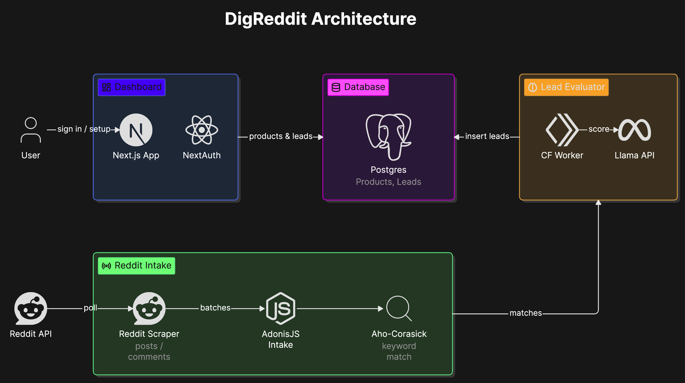

# DigReddit

DigReddit is a Reddit buying-intent pipeline that watches public Reddit activity, filters posts and comments by product keywords, evaluates matched content with an LLM, and stores qualified leads for a web dashboard. The repo is split into three deployable assets: a Next.js dashboard, an AdonisJS intake/scraper service, and a Cloudflare Worker that scores and persists leads.

## What It Is

At a high level, DigReddit turns Reddit posts and comments into ranked product leads. Users define products, keywords, and lead criteria in the dashboard; the backend streams Reddit content, matches it with Aho-Corasick, sends likely matches to the lead evaluator, and the evaluator writes qualified post/comment leads back to Postgres.

## How To Use

Run each asset from its own directory with npm:

```bash
cd client && npm install && npm run dev
cd server && npm install && npm run dev
cd lead_evaluator && npm install && npm run dev
```

For the local pipeline, start the Adonis server first, run the Cloudflare Worker with Wrangler, then run the Reddit scraper worker from `server/scraper_worker/scraper.js` with the required Reddit and lead-evaluator environment variables configured.

## How It Is Built

DigReddit is a three-part system built around a shared Postgres database. The Next.js app owns the user-facing product and lead dashboard, the AdonisJS service owns Reddit ingestion and keyword matching, and the Cloudflare Worker owns semantic lead qualification and database writes.

### Tech Assets

| Asset | Path | Runtime | Responsibility |
| --- | --- | --- | --- |
| Dashboard | `client/` | Next.js, React, Drizzle, NextAuth | Product setup, lead dashboard, filters, bookmarks, collections, and user-facing APIs. |
| Intake and scraper | `server/` | AdonisJS, Node.js, Lucid, Aho-Corasick | Reddit polling, OAuth token refresh, keyword matching, and forwarding matches for semantic evaluation. |
| Lead evaluator | `lead_evaluator/` | Cloudflare Workers, Wrangler, Llama API, Hyperdrive/Postgres | Authenticated lead scoring, product lookup, LLM criteria evaluation, and lead inserts. |

## How The Pieces Tie Together

1. A user signs into the dashboard and creates a product with description, industry, keywords, and scoring criteria.
2. Product data is stored in Postgres in the `Products` table.
3. The server builds an in-memory Aho-Corasick matcher from all product keywords.
4. The Reddit scraper polls Reddit posts or comments, sanitizes each batch, and posts it to the Adonis intake endpoint.
5. The intake endpoint matches each content item against known product keywords.
6. Matched content is forwarded to the Cloudflare Worker with the matching keywords and an authorization key.
7. The Worker loads matching products from Postgres, asks the Llama-compatible API to score the content against each product's criteria, and stores leads with score >= 5.
8. The dashboard reads `PostLeads` and `CommentLeads` from Postgres and lets users filter, sort, bookmark, and move leads through stages.

## Data Flow

The pipeline is optimized as a staged funnel:

| Stage | Input | Output | Purpose |
| --- | --- | --- | --- |
| Product setup | Product description, criteria, keywords | `Products` rows | Defines what a lead should look like. |
| Reddit polling | Reddit post/comment IDs | Sanitized content batches | Converts Reddit API payloads into internal content records. |
| Keyword filtering | Sanitized content + product keywords | Matched content + keywords | Cheaply removes irrelevant content before calling an LLM. |
| Semantic evaluation | Matched content + product criteria | Lead scores and criteria results | Decides whether the content shows buying intent. |
| Lead storage | Qualified scores | `PostLeads` / `CommentLeads` rows | Makes leads available to the dashboard. |
| Dashboard | Stored leads | User workflow | Lets users review, filter, save, and act on leads. |

## Repository Layout

```text
.
├── client/          # Next.js dashboard and app APIs
├── server/          # AdonisJS HTTP service plus Reddit scraper worker
└── lead_evaluator/  # Cloudflare Worker for semantic lead qualification
```

## Environment Variables

Do not commit real `.env` files. Configure secrets locally or through deployment platforms.

### Client

The dashboard expects a Postgres connection string and auth/provider secrets required by NextAuth and Google OAuth.

```bash
DATABASE_URL=
AUTH_SECRET=
AUTH_URL=
GOOGLE_CLIENT_ID=
GOOGLE_CLIENT_SECRET=
NEXT_PUBLIC_APP_URL=
NEXT_PUBLIC_REDDIT_CLIENT_ID=
REDDIT_SECRET=
NEXT_PUBLIC_POSTHOG_KEY=
NEXT_PUBLIC_POSTHOG_HOST=
```

### Server

The server expects Adonis runtime settings, the database URL, Reddit OAuth credentials, and the lead evaluator endpoint/auth key.

```bash
PORT=3333
HOST=localhost
NODE_ENV=development
APP_KEY=
LOG_LEVEL=info
DB_CONNECTION_URL=
LEAD_EVALUATOR_URL=
LEAD_EVALUATOR_AUTH_KEY=
REDDIT_USERNAME=
REDDIT_PASSWORD=
REDDIT_CLIENTID=
REDDIT_CLIENT_SECRET=
REDDIT_API_KEY=
REDDIT_WORKER_THING_TYPE=posts
```

`REDDIT_WORKER_THING_TYPE` controls whether the scraper follows posts (`posts`) or comments (`comments`).

### Lead Evaluator

The Worker expects secrets/bindings in Wrangler or the Cloudflare dashboard.

```bash
SECURITY_KEY=
LLAMA_API_KEY=
GEMINI_API_KEY=
HYPERDRIVE=Cloudflare Hyperdrive binding
```

`GEMINI_API_KEY` is still present in the type/config surface, but the current scoring path uses the Llama-compatible OpenAI client.

## Development Commands

```bash
# Dashboard
cd client
npm install
npm run dev
npm run lint
npm run build

# Server
cd server
npm install
npm run dev
npm run typecheck
npm run test

# Lead evaluator
cd lead_evaluator
npm install
npm run dev
npm test
npm run deploy
```

## Deployment Notes

- Deploy `client/` to a Next.js-compatible host such as Vercel.
- Deploy `server/` anywhere that can run a long-lived Node.js/AdonisJS process and reach Postgres.
- Deploy `lead_evaluator/` with Wrangler to Cloudflare Workers and configure Hyperdrive for Postgres access.
- Run scraper processes separately for posts and comments if both streams should be monitored at the same time.
- Rotate keys immediately if any `.env` value is ever committed or exposed.

## Architecture Diagram



The diagram reads like a left-to-right pipeline with one shared database in the middle.

- The top-left box is the dashboard and auth entry point.
- The bottom-left green lane is Reddit intake: Reddit API, scraper, Adonis intake, and Aho-Corasick keyword matching.
- The center purple box is Postgres, which stores products and leads.
- The top-right gold box is the Cloudflare lead evaluator, which scores matched content with the Llama API and writes leads back to the database.
- The arrows show the flow from user sign-in and product setup to keyword filtering, semantic scoring, and lead storage.
